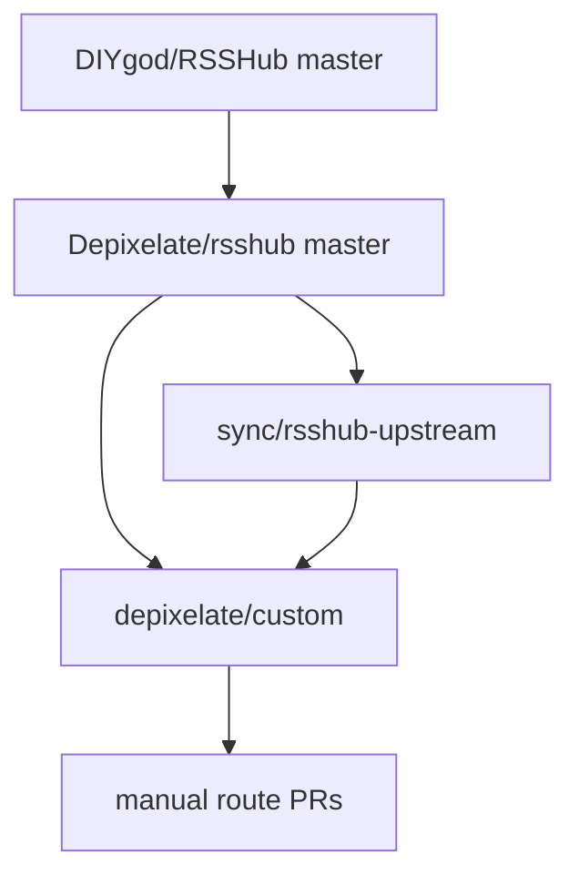
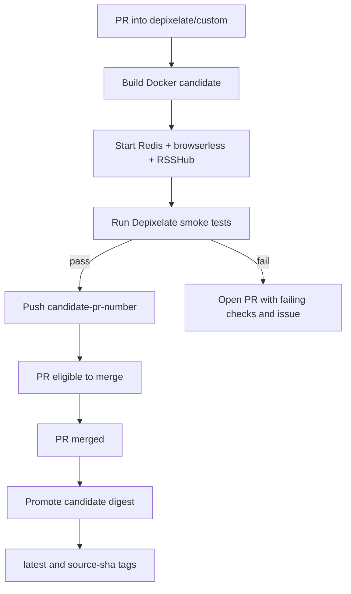

# New Architecture: Full RSSHub Fork with Candidate Image Promotion

This document describes the Depixelate RSSHub architecture after migrating from the old overlay repository.

## Summary

Depixelate RSSHub is now a real fork of upstream RSSHub. The production branch is `depixelate/custom`, custom routes live directly under `lib/routes/depixelate`, and Depixelate-specific automation lives under `depixelate/`.

CI builds a Docker image for each same-repo PR into `depixelate/custom`, smoke-tests that image as a real container, and pushes it as a temporary candidate tag. After the PR merges, CI promotes that exact tested digest to production tags without rebuilding.

## Repository Shape

```text
/home/shuddown/rsshub
├── lib/routes/depixelate/
│   ├── namespace.ts
│   └── adaptionlabs/
├── depixelate/
│   ├── scripts/
│   ├── test/
│   └── smoke-tests.yml
├── .github/workflows/
│   ├── depixelate-candidate.yml
│   ├── depixelate-publish.yml
│   └── depixelate-sync-upstream.yml
├── README.md
├── DECISIONS.md
└── ARCHITECTURE-NEW.md
```

The important ownership boundary is:

- upstream RSSHub source stays in the normal RSSHub tree;
- custom routes live in RSSHub's normal route tree under `lib/routes/depixelate`;
- Depixelate-only support code lives under `depixelate/`;
- live deployment state stays in `/home/shuddown/rsshub-deploy`.

## Branches



- `master` mirrors upstream RSSHub.
- `depixelate/custom` is the default and production branch.
- `sync/rsshub-upstream` is a bot-managed branch for upstream-sync PRs.

## CI Flow



The required candidate check is `build-smoke-candidate`. Branch protection should require that check before PRs can merge.

## Upstream Sync

The upstream-sync workflow runs daily and on manual dispatch. It fetches `DIYgod/RSSHub/master`, mirrors it to fork `master`, merges it into `sync/rsshub-upstream`, and creates or updates a PR into `depixelate/custom`.

If the merge succeeds, the workflow enables GitHub auto-merge. If the candidate image check passes, GitHub merges the PR. If the merge conflicts before a valid PR can be created, the workflow creates or updates a rolling GitHub issue and publishes nothing.

## Deployment

The deployment folder remains:

```text
/home/shuddown/rsshub-deploy
```

The running server continues to track:

```text
ghcr.io/depixelate/rsshub:latest
```

Watchtower does not need to know whether the image was built from the old overlay architecture or the new full fork. It only sees the `latest` tag move after CI promotes a tested image digest.

## Tradeoffs

This architecture removes `.work`, hard links, and overlay-copy build machinery. Local development becomes a normal RSSHub checkout with direct IDE support.

The tradeoff is that the repository now carries the full RSSHub source tree and custom changes must stay disciplined. Depixelate route changes should remain narrow, and upstream-owned files should only be changed when the custom architecture genuinely requires it.
